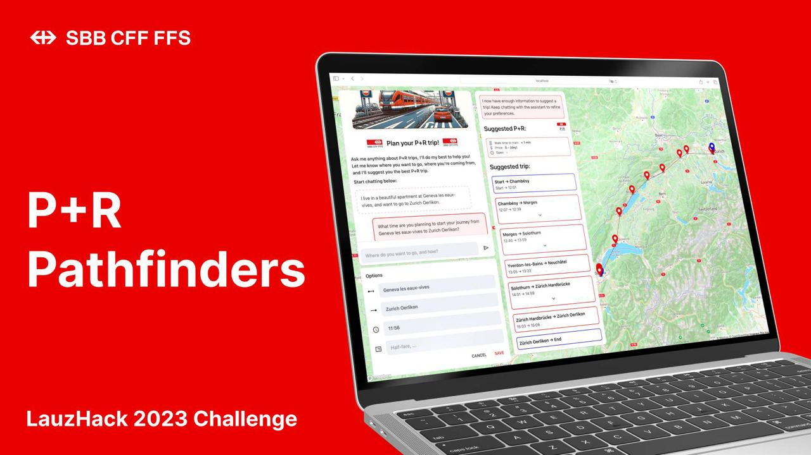

# LauzHack 2023

## Authors
- Alexandre Piveteau
- Matthieu Burguburu
- Victor Schneuwly
- Zacharie Tevaearai

## Organization

This project is built using Compose for Web and Kotlin multiplatform. It is split into 3 modules:

- `common`, which contains the common code between the client and the server;
- `frontend`, which contains the client code; and
- `backend`, which contains the server code.

The code is formatted using Ktfmt. You can install it as an IntelliJ plugin.

## Running the project

The project is built using Gradle. To run the project, you can use the following commands:

```bash
./gradlew run # Starts the server, on port 8888
./gradlew jsBrowserDevelopmentRun --continuous # Starts the client on port 8080
```

You'll need an OpenAI API key to run the project. You generate one [here](https://platform.openai.com/api-keys). 

Once you have an api key and you have credits on your account, you can set it as an environment variable:

```bash
export OPENAI_API_KEY='your_api_key'
```